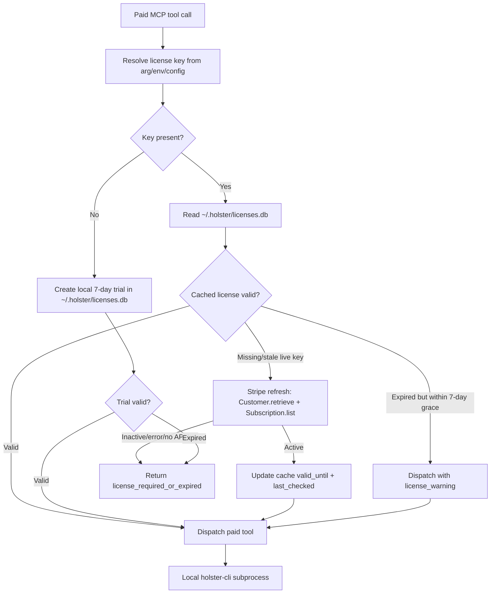

# Holster MCP

Holster MCP exposes local Holster Doctor checks to MCP-compatible agents. The server is local-first: free tools shell out to the bundled `holster-doctor` binary and never send repository contents to a network service.

<!-- mcp-name: io.github.nauta-ai/holster-mcp -->

## Install

From PyPI:

```bash
pip install holster-mcp
```

Development install:

```bash
cd /path/to/holster/mcp
python3.11 -m pip install -e '.[dev]'
```

Runtime command:

```bash
holster-mcp
```

MCP client config:

```json
{
  "mcpServers": {
    "holster": {
      "command": "uvx",
      "args": ["holster-mcp"]
    }
  }
}
```

See the main Holster README for vault and `holster-cli` release binary installation.

License: MIT for the MCP package.

## Binary Resolution

The server locates `holster-doctor` in this order:

1. `HOLSTER_DOCTOR_BIN`
2. Packaged wheel binary at `holster_mcp/bin/holster-doctor`
3. `holster-doctor` on `PATH`
4. Repo-local `target/release/holster-doctor`
5. Repo-local `target/debug/holster-doctor`

## Free Tools

### `holster.scan_repo`

Input:

```json
{"path": "/absolute/repo/path", "depth": 3}
```

Output:

```json
{
  "ok": true,
  "scanned_files": 15,
  "findings": [
    {
      "file": "src/main.py",
      "line": 12,
      "secret_kind": "openai_api_key",
      "severity": "error",
      "suggestion": "Rotate this key and move it into a local vault."
    }
  ]
}
```

### `holster.check_gitignore`

Input:

```json
{"path": "/absolute/repo/path"}
```

Output:

```json
{
  "ok": true,
  "missing_patterns": [".env.local"],
  "existing_safe": [".env"],
  "existing_unsafe": [],
  "suggested_append": ".env.local\n*.pem"
}
```

### `holster.rotation_playbook`

Input:

```json
{"provider": "github"}
```

Output:

```json
{
  "ok": true,
  "provider": "github",
  "steps": ["Create a replacement token...", "Update local consumers...", "Revoke the old token..."],
  "estimated_minutes": 15,
  "warnings": ["Do not revoke the old credential until the replacement has been verified."]
}
```

## Platform Wheels

Day 1 wheels are built for:

- macOS ARM (`aarch64-apple-darwin`)
- Linux x86_64 (`x86_64-unknown-linux-gnu`)

The wheels bundle the platform's `holster-doctor` binary and are intentionally not universal.

## Paid Tools

Paid tools are local-only wrappers around `holster-cli` and are gated by a Holster license.

### License Configuration

License lookup order:

1. `license_key` argument passed to a paid MCP tool
2. `HOLSTER_LICENSE_KEY`
3. `~/.holster/config.toml`

Supported `config.toml` shapes:

```toml
license_key = "holster_live_ABCDEFGHIJKLMNOPQRSTUVWX"
vault_path = "/absolute/path/to/holster-vault.db"
```

or:

```toml
[license]
key = "holster_live_ABCDEFGHIJKLMNOPQRSTUVWX"

[vault]
path = "/absolute/path/to/holster-vault.db"
```

License cache:

```text
~/.holster/licenses.db
```

If no license is configured, the first paid-tool call creates a local 7-day trial key with prefix `holster_trial_`.

### Vault Configuration

Vault path lookup order:

1. explicit tool argument where supported
2. `HOLSTER_VAULT_PATH`
3. `~/.holster/config.toml`

### `holster.vault_add`

Input:

```json
{
  "provider": "github",
  "account": "nauta-ai",
  "secret": "user-pasted-secret",
  "label": "primary"
}
```

Output:

```json
{"ok": true, "vault_entry_id": "123e4567-e89b-12d3-a456-426614174000", "error": null}
```

The secret value is never placed in CLI argv, logs, or structured error output.

### `holster.vault_rotate`

Day 2 supports `github` and `stripe`.

Without `new_secret`, the tool returns the provider playbook and waits for the human to rotate/paste the replacement:

```json
{
  "provider": "github",
  "account": "nauta-ai",
  "vault_entry_id": "old-id"
}
```

With `new_secret`, the replacement is added to the local vault and the old entry is marked superseded when the installed CLI supports that command.

### `holster.audit_log`

Input:

```json
{"provider": "github", "account": "nauta-ai", "since_days": 30}
```

Output:

```json
{"ok": true, "events": [{"ts": "...", "action": "add", "provider": "github", "account": "nauta-ai", "ok": true}]}
```

## License Architecture



The background poller refreshes cached live licenses every 10 minutes after a paid tool validates. There is no webhook receiver in Day 2 and no telemetry in V1.
